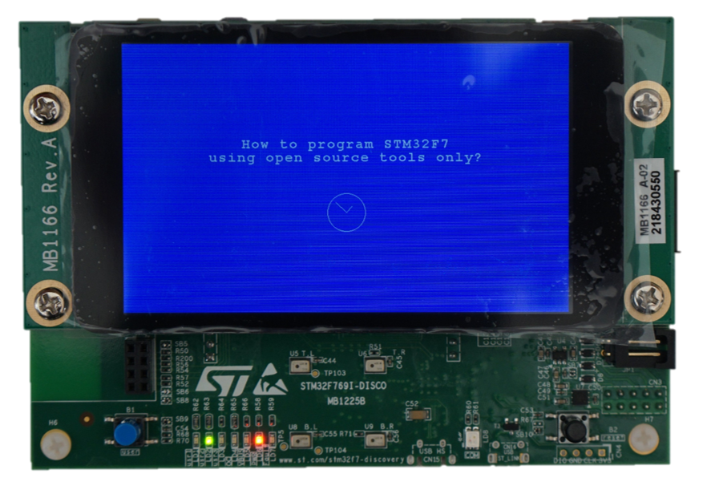

### This repo contains demo project for STMicroelectronics STM32F769I-DISCO discovery kit with LCD display support demonstrating how to program and debug STM32F7 with open source, cross-platform tools only.
Open this project with VS Code.  
See [How to program STM32F7.pdf](How-to-program-STM32F7.pdf) for step-by-step instructions.

### Required tools:
* VS Code https://code.visualstudio.com
* VS Code extensions:
    * C/C++
    * Cortex-Debug
    * Build++
    * LinkerScript
    * Intel HEX Format
    * Code Spell Checker
* Git https://git-scm.com
* GNU Arm Embedded Toolchain  
https://developer.arm.com/tools-and-software/open-source-software/developer-tools/gnu-toolchain/gnu-rm
* GNU Make https://www.gnu.org/software/make  
download: https://github.com/mbuilov/gnumake-windows
* StLink Tools https://github.com/texane/stlink
* node.js https://nodejs.org
* cppbuild tool https://github.com/tdjastrzebski/cppbuild  
`npm install cppbuild -g`

### Feedback
Do not hesitate to leave comments/suggestions.  
If you find this useful, please give it a star. This way others will be able to find it more easily.

